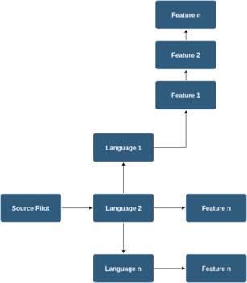

# Contribute



- source-pilot contains multiple language classes
- Each language class has multiple features
- Each feature has two primary methods. One to match the input, and another one to create target url from that input
 (if and only if it matches with former method)
 
 #### How do I support a new language ?
 
 **Step 1**
 
 - Create a new `class` which extends from `LanguageSupport`
 
 ```kotlin
package languages.mynewlanguage

import base.LanguageSupport
import core.BaseFeature

class MyNewLanguage : LanguageSupport() {
    override fun getFileExtension(): String {
        return "myext"
    }

    override fun getFeatures(): List<BaseFeature> {
        return listOf(
            Feature1(),
            Feature2(),
            FeatureN()                        
        )
    }
}
```

- `getFileExtension` : Return file extension. eg: `java`, `py`, `js` etc (without `dot`)
- `getFeatures` : Return features

**Step 1 : Rules**

- The newly created language must be created under `language/mynewlanguage` package/folder, where `mynewlanguage` is the language name. (lowercase only)


**Step 2**
 
 - Create feature and add it to the `getFeatures()` method in `MyNewLanguage`
 
 ```kotlin
package languages.mynewlanguage.features

import base.LanguageSupport
import core.BaseFeature
import org.w3c.dom.HTMLSpanElement

class Feature1(languageSupport: LanguageSupport) : BaseFeature(languageSupport) {
    
    override fun isMatch(inputText: String, htmlSpanElement: HTMLSpanElement): Boolean {
        /**
         * language detection logic goes here
         */
        return isMyLanguageElement(inputText)
    }

    override fun handle(inputText: String, htmlSpanElement: HTMLSpanElement, callback: (url: String?, isNewTab: Boolean) -> Unit) {
        /**
         * Below method generates url to which will be opened when control+clicked on the element
         */
        val newUrl = generateTargetUrl(htmlSpanElement, inputText)

        /**
         * Returning result
         */
        callback(newUrl, true)
    }
} 
```
  

**Step 2 : Rules**
  
  - The newly created feature must be created under `language/mynewlanguage/features` package/folder.


**Step 3**
    - Add `MyNewLanguage` to `utils/SupportManager.kt`
    
```kotlin
class SupportManager {


    fun getSupportForCurrentFile(): LanguageSupport? {

        val supportedLanguages = arrayOf(
                // other languages
                ...,
                MyNewLanguage()
        )

        ...
    }

}
```

Done 👍
    
  
  


